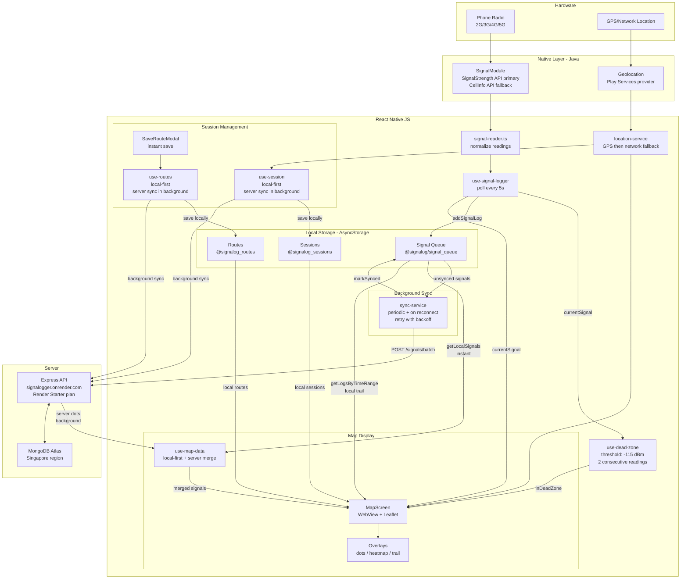

# Signalog — Architecture Diagram

Last updated: 2026-04-02

## System Architecture



## Data Flow Summary

### Signal Reading (Radio to Storage)
```
Phone Radio
  -> SignalModule.getSignalInfo() [Java, SignalStrength API]
  -> signal-reader.ts [normalize]
  -> use-signal-logger [poll every 5s]
  -> log-store.addSignalLog() [AsyncStorage, instant]
  -> sync-service [background, batch upload]
  -> POST /signals/batch [server]
  -> MongoDB
```

### Map Display (Storage to Screen)
```
Map viewport changes
  -> use-map-data.fetchData(bounds, zoom, filters)

  IF zoom >= 14 (zoomed in):
    -> getLocalSignals(bounds) [AsyncStorage, instant]
    -> api.signals.query(bounds) [server, background]
    -> merge + deduplicate + filter
    -> render dots on Leaflet map

  IF zoom < 14 (zoomed out):
    -> show cached heatmap tiles [instant]
    -> api.heatmap.getTiles() [server, background]
    -> update cache + render
```

### Session Recording
```
User taps "Start Mapping"
  -> use-session.startSession()
  -> save to AsyncStorage [instant]
  -> POST /sessions [background]
  -> start signal logging

User taps "Stop Mapping"
  -> use-session.completeSession()
  -> calculate stats locally [instant]
  -> save to AsyncStorage [instant]
  -> PATCH /sessions/:id [background]
  -> show SaveRouteModal [instant]
```

### Dead Zone Detection
```
use-signal-logger [every 5s]
  -> use-dead-zone.processReading(dbm, networkType)

  IF networkType === 'none' (airplane mode):
    -> immediate dead zone display

  IF dbm < -115 for 2 consecutive readings:
    -> set inDeadZone = true
    -> vibrate (double buzz)
    -> show DeadZoneBanner
    -> gray out map controls
    -> 5-minute cooldown

  IF signal recovers:
    -> set inDeadZone = false
    -> vibrate (single buzz)
    -> restore normal UI
```

## Local-First Architecture

| Data | Local Storage | Server Sync |
|------|--------------|-------------|
| Signal logs | AsyncStorage queue | Background batch upload |
| Sessions | AsyncStorage (@signalog_sessions) | Background create/complete |
| Routes | AsyncStorage (@signalog_routes) | Background create |
| Map dots | Read from local queue | Merge with server crowd data |
| Trail | Read by time range from local | Fetch from server as enhancement |
| Heatmap | In-memory cache | Server-only (crowd data) |

**Principle:** Local storage is source of truth for user's own data. Server provides crowd-sourced data and backup. UI never blocks on server calls.
